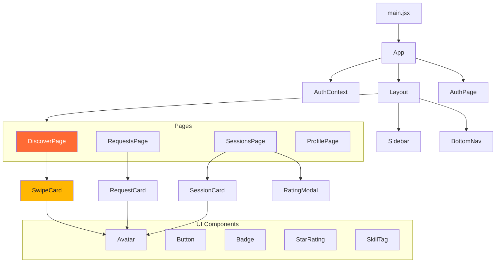
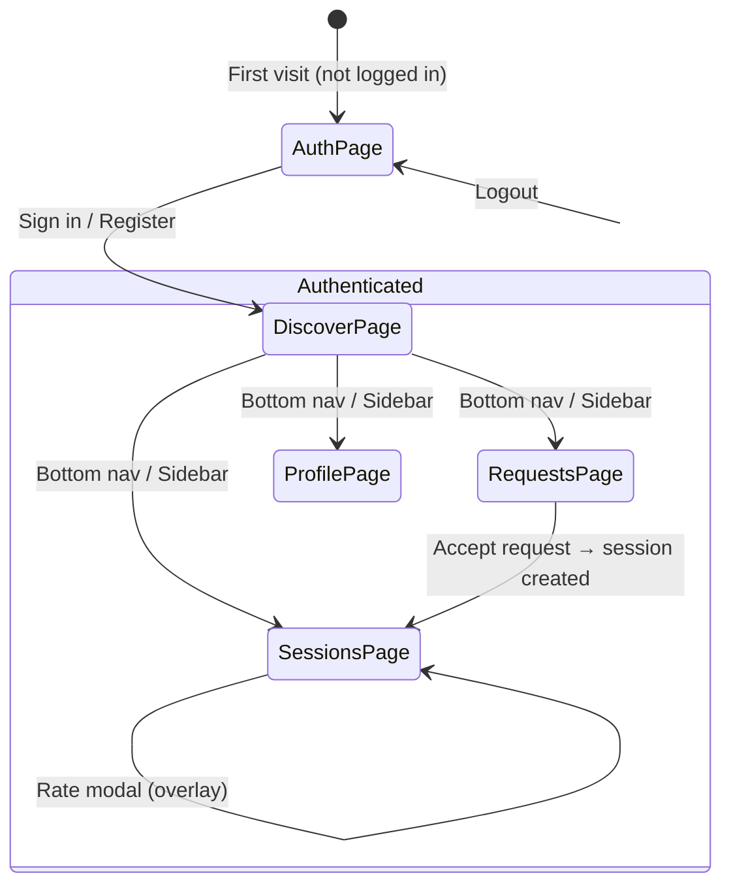
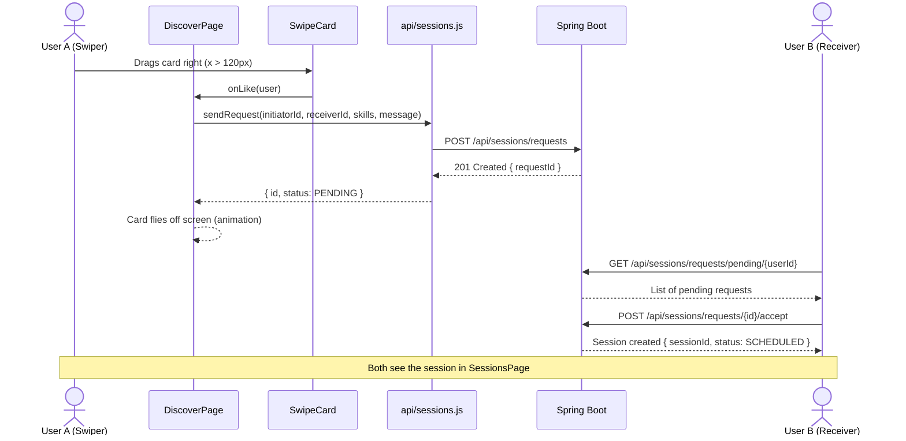
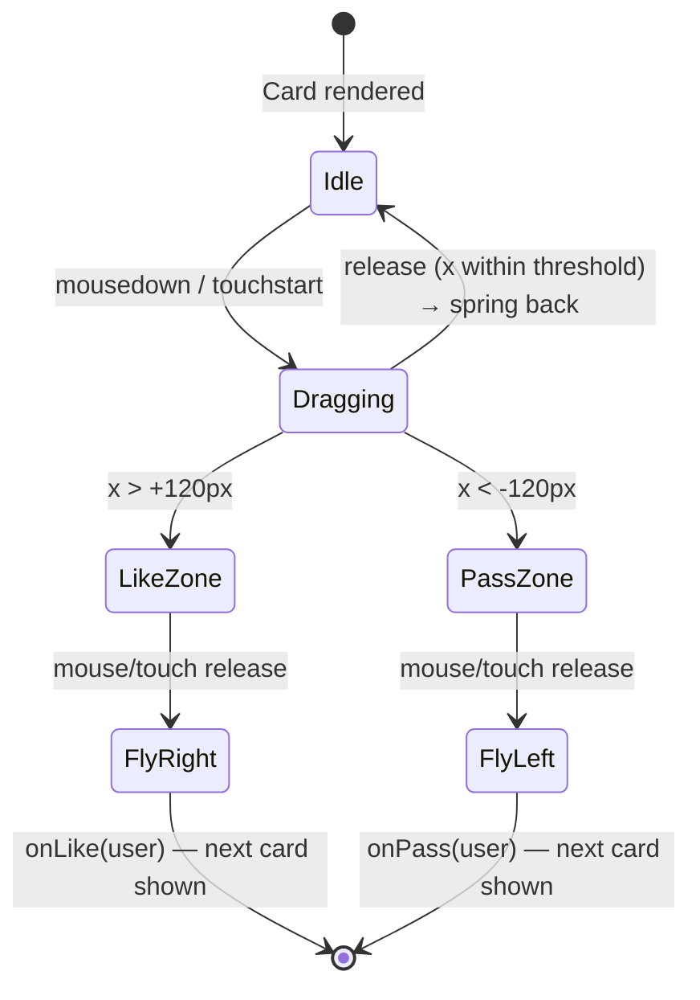

# SkillSwap — Frontend

React + Vite + Tailwind CSS frontend for the SkillSwap platform.  
Tinder-inspired skill matching with swipeable profile cards.

## Stack

| Tool | Purpose |
|---|---|
| React 18 | UI framework |
| Vite 5 | Build tool / dev server |
| Tailwind CSS 3 | Utility-first styling |
| Framer Motion | Swipe animations & transitions |
| React Router v6 | Client-side routing |
| Lucide React | Icon library |
| Axios | HTTP client |

## Color System

| Token | Hex | Usage |
|---|---|---|
| `primary` | `#FF6B35` | CTAs, active nav, skill tags |
| `danger` | `#E63946` | Pass action, decline button |
| `accent` | `#FFB703` | Stars, badges, highlights |
| `surface` | `#FFFBF5` | App background |
| `dark` | `#1A1A2E` | Body text |

## Getting started

```bash
cd frontend
cp .env.example .env
npm install
npm run dev        # → http://localhost:3000
```

The dev server proxies `/api` to `http://localhost:8080` (Spring Boot).

## Project structure

```
src/
├── api/            # Axios calls (connects to Spring Boot REST controllers)
├── components/
│   ├── cards/      # SwipeCard, RequestCard, SessionCard
│   ├── layout/     # Layout, Sidebar, BottomNav
│   └── ui/         # Button, Badge, Avatar, StarRating, SkillTag
├── context/        # AuthContext (JWT-ready, mock for now)
├── data/           # mockData.js — realistic sample data
└── pages/          # AuthPage, DiscoverPage, RequestsPage, SessionsPage, ProfilePage
uml/                # PlantUML diagrams (components, navigation, sequences)
```

---

## UML Diagrams (Mermaid)

### Component Architecture



---

### Page Navigation Flow



---

### Sequence: Swipe Right → Session Request



---

### Swipe Card State Machine


